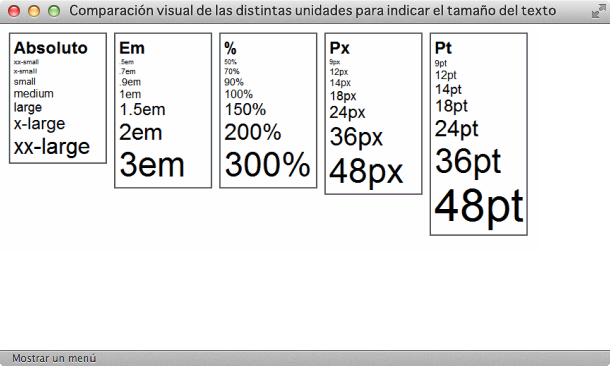
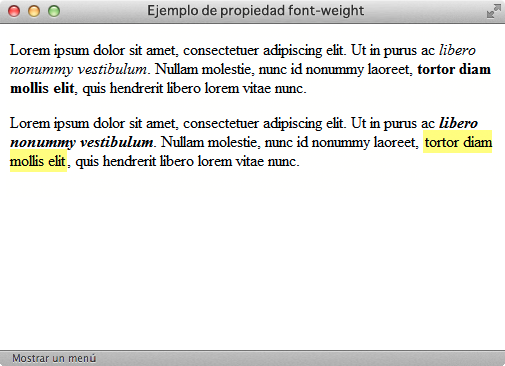
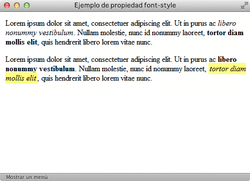
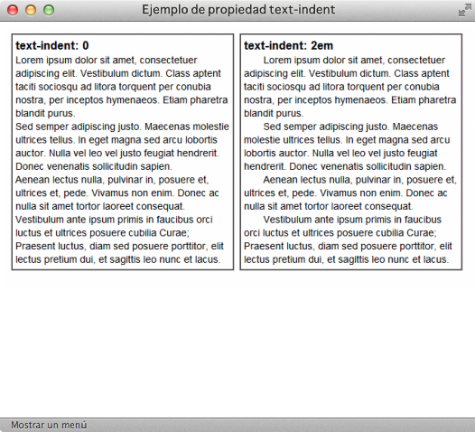
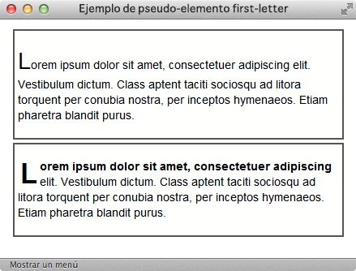

# Texto

## Tipografía

CSS define numerosas propiedades para modificar la apariencia del texto. A pesar de que no dispone de tantas posibilidades como los lenguajes y programas específicos para crear documentos impresos, CSS permite aplicar estilos complejos y muy variados al texto de las páginas web.

La propiedad básica que define CSS relacionada con la tipografía se denomina color y se utiliza para establecer el color de la letra.

| Propiedad             | `color`    |
| --------------------: | :------------- |
| **Valores** | color \| inherit |
| **Se aplica a** | Todos los elementos |
| **Valor inicial**  | Depende del navegador |
| **Descripción**       | Establece el color de letra utilizado para el texto |

Aunque el color por defecto del texto depende del navegador, todos los navegadores principales utilizan el color negro. Para establecer el color de letra de un texto, se puede utilizar cualquiera de las cinco formas que incluye CSS para definir un color.

A continuación se muestran varias reglas CSS que establecen el color del texto de diferentes formas:

    [css]
    h1 { color: #369; }
    p  { color: black; }
    a, span { color: #B1251E; }
    div { color: rgb(71, 98, 176); }

Como el valor de la propiedad `color` se hereda, normalmente se establece la propiedad `color` en el elemento `body para establecer el color de letra de todos los elementos de la página:

    [css]
    h1 { color: #777; }

En el ejemplo anterior, todos los elementos de la página muestran el mismo color de letra salvo que establezcan de forma explícita otro color. La única excepción de este comportamiento son los enlaces que se crean con la etiqueta `<a>`. Aunque el color de la letra se hereda de los elementos padre a los elementos hijo, con los enlaces no sucede lo mismo, por lo que es necesario indicar su color de forma explícita:

    [css]
    /* Establece el mismo color a todos los elementos
    de la página salvo los enlaces */
    body { color: #777; }
    
    /* Establece el mismo color a todos los elementos
    de la página, incluyendo los enlaces */
    body, a { color: #777; }

La otra propiedad básica que define CSS relacionada con la tipografía se denomina `font-family` y se utiliza para indicar el tipo de letra con el que se muestra el texto.

| Propiedad             | `font-family`  |
| --------------------: | :------------- |
| **Valores** | (( nombre_familia | familia_generica ) (,nombre_familia | familia_generica)* ) \| inherit |
| **Se aplica a** | Todos los elementos |
| **Valor inicial**  | Depende del navegador |
| **Descripción**       | Establece el tipo de letra utilizado para el texto |

El tipo de letra del texto se puede indicar de dos formas diferentes:

* Mediante el nombre de una familia tipográfica: en otras palabras, mediante el nombre del tipo de letra, como por ejemplo "Arial", "Verdana", "Garamond", etc.

* Mediante el nombre genérico de una familia tipográfica: los nombres genéricos no se refieren a ninguna fuente en concreto, sino que hacen referencia al estilo del tipo de letra. Las familias genéricas definidas son `serif` (tipo de letra similar a Times New Roman), `sans-serif` (tipo Arial), `cursive` (tipo Comic Sans), `fantasy` (tipo Impact) y `monospace` (tipo Courier New).

Los navegadores muestran el texto de las páginas web utilizando los tipos de letra instalados en el ordenador o dispositivo del propio usuario. De esta forma, si el diseñador indica en la propiedad `font-family` que el texto debe mostrarse con un tipo de letra especialmente raro o rebuscado, casi ningún usuario dispondrá de ese tipo de letra.

Para evitar el problema común de que el usuario no tenga instalada la fuente que quiere utilizar el diseñador, CSS permite indicar en la propiedad `font-family` más de un tipo de letra. El navegador probará en primer lugar con el primer tipo de letra indicado. Si el usuario la tiene instalada, el texto se muestra con ese tipo de letra.

Si el usuario no dispone del primer tipo de letra indicado, el navegador irá probando con el resto de tipos de letra hasta que encuentre alguna fuente que esté instalada en el ordenador del usuario. Evidentemente, el diseñador no puede indicar para cada propiedad `font-family` tantos tipos de letra como posibles fuentes parecidas existan.

Para solucionar este problema se utilizan las familias tipográficas genéricas. Cuando la propiedad `font-family` toma un valor igual a `sans-serif`, el diseñador no indica al navegador que debe utilizar la fuente Arial, sino que debe utilizar "la fuente que más se parezca a Arial de todas las que tiene instaladas el usuario".

Por todo ello, el valor de `font-family suele definirse como una lista de tipos de letra alternativos separados por comas. El último valor de la lista es el nombre de la familia tipográfica genérica que más se parece al tipo de letra que se quiere utilizar.

Las listas de tipos de letra más utilizadas son las siguientes:

    [css]
    font-family: Arial, Helvetica, sans-serif;
    font-family: "Times New Roman", Times, serif;
    font-family: "Courier New", Courier, monospace;
    font-family: Georgia, "Times New Roman", Times, serif;
    font-family: Verdana, Arial, Helvetica, sans-serif;

Ya que las fuentes que se utilizan en la página deben estar instaladas en el ordenador del usuario, cuando se quiere disponer de un diseño complejo con fuentes muy especiales, se debe recurrir a soluciones alternativas.

La solución más sencilla consiste en crear imágenes en las que se muestra el texto con la fuente deseada. Esta técnica solamente es viable para textos cortos (por ejemplo los titulares de una página) y puede ser manual (creando las imágenes una por una) o automática, utilizando JavaScript, PHP y/o CSS.

Otra alternativa es la de la sustitución automática de texto basada en Flash. La técnica más conocida es la de sIFR, de la que se puede encontrar más información en http://wiki.novemberborn.net/sifr

Una vez seleccionado el tipo de letra, se puede modificar su tamaño mediante la propiedad `font-size`.

| Propiedad             | `font-size`    |
| --------------------: | :------------- |
| **Valores** | tamaño_absoluto \| tamaño_relativo \| unidad de medida \| porcentaje \| inherit |
| **Se aplica a** | Todos los elementos |
| **Valor inicial**  | medium |
| **Descripción**       | Establece el tamaño de letra utilizado para el texto |

Además de todas las unidades de medida relativas y absolutas y el uso de porcentajes, CSS permite utilizar una serie de palabras clave para indicar el tamaño de letra del texto:

* `tamaño_absoluto`: indica el tamaño de letra de forma absoluta mediante alguna de las siguientes palabras clave: `xx-small`, `x-small`, `small`, `medium`, `large`, `x-large`, `xx-large`.

* `tamaño_relativo`: indica de forma relativa el tamaño de letra del texto mediante dos palabras clave (`larger`, `smaller`) que toman como referencia el tamaño de letra del elemento padre.

La siguiente imagen muestra una comparación entre los tamaños típicos del texto y las unidades que más se utilizan:

CSS recomienda indicar el tamaño del texto en la unidad `em` o en porcentaje (`%`). Además, es habitual indicar el tamaño del texto en puntos (`pt`) cuando el documento está específicamente diseñado para imprimirlo.

Por defecto los navegadores asignan los siguientes tamaños a los títulos de sección: `<h1>` = `xx-large`, `<h2>` = `x-large`, `<h3>` = `large`, `<h4>` = `medium`, `<h5>` = `small`, `<h6>` = `xx-small`.

Una vez indicado el tipo y el tamaño de letra, es habitual modificar otras características como su grosor (texto en negrita) y su estilo (texto en cursiva). La propiedad que controla la anchura de la letra es `font-weight`.

| Propiedad             | `font-weight`    |
| --------------------: | :------------- |
| **Valores** | normal \| bold \| bolder \| lighter \| 100 \| 200 \| 300 \| 400 \| 500 \| 600 \| 700 \| 800 \| 900 \| inherit |
| **Se aplica a** | Todos los elementos |
| **Valor inicial**  | normal |
| **Descripción**       | Establece la anchura de la letra utilizada para el texto |

Los valores que normalmente se utilizan son `normal` (el valor por defecto) y `bold` para los textos en negrita. El valor `normal` equivale al valor numérico `400` y el valor `bold` al valor numérico `700`.

El siguiente ejemplo muestra una aplicación práctica de la propiedad `font-weight`:

Por defecto, los navegadores muestran el texto de los elementos `<em>` en cursiva y el texto de los elementos `<strong>` en negrita. La propiedad `font-weight` permite alterar ese aspecto por defecto y mostrar por ejemplo los elementos `<em>` como cursiva y negrita y los elementos `<strong>` destacados mediante un color de fondo y sin negrita.

Las reglas CSS del ejemplo anterior se muestran a continuación:

    [css]
    #especial em {
        font-weight: bold;
    }
    #especial strong {
        font-weight: normal;
        background-color: #FFFF66;
        padding: 2px;
    }

    [html]
    
Lorem ipsum dolor sit amet, consectetuer adipiscing elit. Ut in
    purus ac <em>libero nonummy vestibulum</em>. Nullam molestie, nunc id
    nonummy laoreet, <strong>tortor diam mollis elit</strong>, quis hendrerit
    libero lorem vitae nunc.

    
    
Lorem ipsum dolor sit amet, consectetuer adipiscing elit.
    Ut in purus ac <em>libero nonummy vestibulum</em>. Nullam molestie, nunc id
    nonummy laoreet, <strong>tortor diam mollis elit</strong>, quis hendrerit
    libero lorem vitae nunc.

Además de la anchura de la letra, CSS permite variar su estilo mediante la propiedad `font-style`.

| Propiedad             | `font-style`    |
| --------------------: | :------------- |
| **Valores** | normal \| italic \| oblique \| inherit |
| **Se aplica a** | Todos los elementos |
| **Valor inicial**  | normal |
| **Descripción**       | Establece el estilo de la letra utilizada para el texto |

Normalmente la propiedad `font-style` se emplea para mostrar un texto en cursiva mediante el valor `italic`.

El ejemplo anterior se puede modificar para personalizar aun más el aspecto por defecto de los elementos `<em>` y `<strong>`:

Ahora, el texto del elemento `<em>` se muestra como un texto en negrita y el texto del elemento `<strong>` se muestra como un texto en cursiva con un color de fondo muy destacado.

El único cambio necesario en las reglas CSS anteriores es el de añadir la propiedad `font-style`:

    [css]
    #especial em {
        font-weight: bold;
        font-style: normal;
    }
    #especial strong {
        font-weight: normal;
        font-style: italic;
        background-color:#FFFF66;
        padding: 2px;
    }

Por último, CSS permite otra variación en el estilo del tipo de letra, controlado mediante la propiedad `font-variant`.

| Propiedad             | `font-variant`    |
| --------------------: | :------------- |
| **Valores** | normal \| small-caps \| inherit|
| **Se aplica a** | Todos los elementos |
| **Valor inicial**  | normal |
| **Descripción**       | Establece el estilo alternativo de la letra utilizada para el texto |

La propiedad `font-variant` no se suele emplear habitualmente, ya que sólo permite mostrar el texto con letra versal (mayúsculas pequeñas).

Siguiendo con el ejemplo anterior, se ha aplicado la propiedad `font-variant: small-caps al segundo párrafo de texto:

Para este último ejemplo, solamente es necesario añadir una regla a los estilos CSS:

    [css]
    #especial {
        font-variant: small-caps;
    }

Por otra parte, CSS proporciona una propiedad tipo "shorthand" denominada `font` y que permite indicar de forma directa algunas o todas las propiedades de la tipografía de un texto.

| Propiedad             | `font`    |
| --------------------: | :------------- |
| **Valores** | ( ( font-style || font-variant || font-weight )? font-size ( / line-height )? font-family ) \| caption \| icon \| menu \| message-box \| small-caption \| status-bar \| inherit |
| **Se aplica a** | Todos los elementos |
| **Valor inicial**  | - |
| **Descripción**       | Permite indicar de forma directa todas las propiedades de la tipografía de un texto |

El orden en el que se deben indicar las propiedades del texto es el siguiente:

* En primer lugar y de forma opcional se indican el `font-style`, `font-variant` y `font-weight` en cualquier orden.

* A continuación, se indica obligatoriamente el valor de `font-size` seguido opcionalmente por el valor de `line-height`.

* Por último, se indica obligatoriamente el tipo de letra a utilizar.

Ejemplos de uso de la propiedad `font`:

    [css]
    font: 76%/140% Verdana,Arial,Helvetica,sans-serif;
    font: normal 24px/26px "Century Gothic","Trebuchet MS",Arial,Helvetica,sans-serif;
    font: normal .94em "Trebuchet MS",Arial,Helvetica,sans-serif;
    font: bold 1em "Trebuchet MS",Arial,Sans-Serif;
    font: normal 0.9em "Lucida Grande", Verdana, Arial, Helvetica, sans-serif;
    font: normal 1.2em/1em helvetica, arial, sans-serif;
    font: 11px verdana, sans-serif;
    font: normal 1.4em/1.6em "helvetica", arial, sans-serif;
    font: bold 14px georgia, times, serif;

Aunque su uso no es muy común, la propiedad `font` también permite indicar el tipo de letra a utilizar mediante una serie de palabras clave: `caption`, `icon`, `menu`, `message-box`, `small-caption`, `status-bar`.

Si por ejemplo se utiliza la palabra `status-bar`, el navegador muestra el texto con el mismo tipo de letra que la que utiliza el sistema operativo para mostrar los textos de la barra de estado de las ventanas. La palabra `icon` se puede utilizar para mostrar el texto con el mismo tipo de letra que utiliza el sistema operativo para mostrar el nombre de los iconos y así sucesivamente.

  
Ejercicio 7

[Ver enunciado](#ej07)

## Texto

Además de las propiedades relativas a la tipografía del texto, CSS define numerosas propiedades que determinan la apariencia del texto en su conjunto. Estas propiedades adicionales permiten controlar al alineación del texto, el interlineado, la separación entre palabras, etc.

La propiedad que define la alineación del texto se denomina `text-align`.

| Propiedad             | `text-align`    |
| --------------------: | :------------- |
| **Valores** | left \| right \| center \| justify \| inherit |
| **Se aplica a** | Elementos de bloque y celdas de tabla |
| **Valor inicial**  | left |
| **Descripción**       | Establece la alineación del contenido del elemento |

Los valores definidos por CSS permiten alinear el texto según los valores tradicionales: a la izquierda (`left`), a la derecha (`right`), centrado (`center`) y justificado (`justify`).

La siguiente imagen muestra el efecto de establecer el valor left, right, center y justify respectivamente a cada uno de los párrafos de la página.

La propiedad `text-align` no sólo alinea el texto que contiene un elemento, sino que también alinea todos sus contenidos, como por ejemplo las imágenes.

El interlineado de un texto se controla mediante la propiedad `line-height`, que permite controlar la altura ocupada por cada línea de texto:

| Propiedad             | `line-height`    |
| --------------------: | :------------- |
| **Valores** | normal \| numero \| unidad de medida \| porcentaje \| inherit |
| **Se aplica a** | Todos los elementos |
| **Valor inicial**  | normal |
| **Descripción**       | Permite establecer la altura de línea de los elementos |

Además de todas las unidades de medida y el uso de porcentajes, la propiedad line-height permite indicar un número sin unidades que se interpreta como el múltiplo del tamaño de letra del elemento. Por tanto, estas tres reglas CSS son equivalentes:

    [css]
    p { line-height: 1.2; font-size: 1em }
    p { line-height: 1.2em; font-size: 1em }
    p { line-height: 120%; font-size: 1em }

Siempre que se utilice de forma moderada, el interlineado mejora notablemente la legibilidad de un texto, como se puede observar en la siguiente imagen:

Además de la decoración que se puede aplicar a la tipografía que utilizan los textos, CSS define otros estilos y decoraciones para el texto en su conjunto. La propiedad que decora el texto se denomina `text-decoration`.

| Propiedad             | `text-decoration`    |
| --------------------: | :------------- |
| **Valores** | none \| ( underline \|| overline \|| line-through\ || blink ) \| inherit |
| **Se aplica a** | Todos los elementos |
| **Valor inicial**  | none |
| **Descripción**       | Establece la decoración del texto (subrayado, tachado, parpadeante, etc.) |

El valor `underline` subraya el texto, por lo que puede confundir a los usuarios haciéndoles creer que se trata de un enlace. El valor `overline` añade una línea en la parte superior del texto, un aspecto que raramente es deseable. El valor `line-through` muestra el texto tachado con una línea continua, por lo que su uso tampoco es muy habitual. Por último, el valor `blink` muestra el texto parpadeante y se recomienda evitar su uso por las molestias que genera a la mayoría de usuarios.

Una de las propiedades de CSS más desconocidas y que puede ser de gran utilidad en algunas circunstancias es la propiedad `text-transform`, que puede variar de forma sustancial el aspecto del texto.

| Propiedad             | `text-transform`    |
| --------------------: | :------------- |
| **Valores** | capitalize \| uppercase \| lowercase \| none \| inherit |
| **Se aplica a** | Todos los elementos |
| **Valor inicial**  | none |
| **Descripción**       | Transforma el texto original (lo transforma a mayúsculas, a minúsculas, etc.) |

La propiedad `text-transform` permite mostrar el texto original transformado en un texto completamente en mayúsculas (`uppercase`), en minúsculas (`lowercase`) o con la primera letra de cada palabra en mayúscula (`capitalize`).

La siguiente imagen muestra cada uno de los posibles valores:

Las reglas CSS del ejemplo anterior se muestran a continuación:

    [html]
    

        <h1>Original</h1>
        Lorem ipsum dolor sit amet...

    
    

        <h1>text-transform: capitalize</h1>
        Lorem ipsum dolor sit amet...
    

    
    

        <h1>text-transform: lowercase</h1>
        Lorem ipsum dolor sit amet...
    

    
    

        <h1>text-transform: uppercase</h1>
        Lorem ipsum dolor sit amet...
    

Uno de los principales problemas del diseño de documentos y páginas mediante CSS consiste en la alineación vertical en una misma línea de varios elementos diferentes como imágenes y texto. Para controlar esta alineación, CSS define la propiedad `vertical-align`.

| Propiedad             | `vertical-align`    |
| --------------------: | :------------- |
| **Valores** | baseline \| sub \| super \| top \| text-top \| middle \| bottom \| text-bottom \| porcentaje \| unidad de medida \| inherit |
| **Se aplica a** | Elementos en línea y celdas de tabla |
| **Valor inicial**  | baseline |
| **Descripción**       | Determina la alineación vertical de los contenidos de un elemento |

A continuación se muestra una imagen con el aspecto que muestran los navegadores para cada uno de los posibles valores de la propiedad `vertical-align`:

El valor por defecto es `baseline` y el valor más utilizado cuando se establece la propiedad `vertical-align` es middle.

En muchas publicaciones impresas suele ser habitual tabular la primera línea de cada párrafo para facilitar su lectura. CSS permite controlar esta tabulación mediante la propiedad `text-indent`.

| Propiedad             | `text-indent    |
| --------------------: | :------------- |
| **Valores** | unidad de medida \| porcentaje \| inherit |
| **Se aplica a** | Los elementos de bloque y las celdas de tabla |
| **Valor inicial**  | 0 |
| **Descripción**       | Tabula desde la izquierda la primera línea del texto original |

La siguiente imagen muestra la comparación entre un texto largo formado por varios párrafos sin tabular y el mismo texto con la primera línea de cada párrafo tabulada:

CSS también permite controlar la separación entre las letras que forman las palabras y la separación entre las palabras que forman los textos. La propiedad que controla la separación entre letras se llama `letter-spacing` y la separación entre palabras se controla mediante `word-spacing`.

| Propiedad             | `letter-spacing`    |
| --------------------: | :------------- |
| **Valores** | normal \| unidad de medida \| inherit |
| **Se aplica a** | Todos los elementos |
| **Valor inicial**  | normal |
| **Descripción**       | Permite establecer el espacio entre las letras que forman las palabras del texto |

| Propiedad             | `word-spacing`    |
| --------------------: | :------------- |
| **Valores** | normal \| unidad de medida \| inherit |
| **Se aplica a** | Todos los elementos |
| **Valor inicial**  | normal |
| **Descripción**       | Permite establecer el espacio entre las palabras que forman el texto |

La siguiente imagen muestra la comparación entre un texto normal y otro con las propiedades `letter-spacing` y `word-spacing aplicadas:

Las reglas CSS del ejemplo anterior se muestran a continuación:

    [css]
    .especial h1 { letter-spacing: .2em; }
    .especial p { word-spacing: .5em; }

    [html]
    

        <h1>Lorem ipsum dolor sit amet</h1>
        
Lorem ipsum dolor sit amet, consectetuer adipiscing elit. Vestibulum 
        dictum. Class aptent taciti sociosqu ad litora torquent per conubia nostra, 
        per inceptos hymenaeos. Etiam pharetra blandit purus.

        ...
    

    
    

        <h1>Lorem ipsum dolor sit amet</h1>
        
Lorem ipsum dolor sit amet, consectetuer adipiscing elit. Vestibulum 
        dictum. Class aptent taciti sociosqu ad litora torquent per conubia nostra, 
        per inceptos hymenaeos. Etiam pharetra blandit purus.

        ...
    

Cuando se utiliza un valor numérico en las propiedades `letter-spacing` y `word-spacing`, se interpreta como la separación adicional que se añade (si el valor es positivo) o se quita (si el valor es negativo) a la separación por defecto entre letras y palabras respectivamente.

Como ya se sabe, el tratamiento que hace HTML de los espacios en blanco es uno de los aspectos más difíciles de comprender cuando se empiezan a crear las primeras páginas web. Básicamente, HTML elimina todos los espacios en blanco sobrantes, es decir, todos salvo un espacio en blanco entre cada palabra.

Para forzar los espacios en blanco adicionales se debe utilizar la entidad HTML `&nbsp;` y para forzar nuevas líneas, se utiliza el elemento ` `. Además, HTML proporciona el elemento `<pre>` que muestra el contenido tal y como se escribe, respetando todos los espacios en blanco y todas las nuevas líneas.

CSS también permite controlar el tratamiento de los espacios en blanco de los textos mediante la propiedad `white-space`.

| Propiedad             | `white-space`    |
| --------------------: | :------------- |
| **Valores** | normal \| pre \| nowrap \| pre-wrap \| pre-line \| inherit |
| **Se aplica a** | Todos los elementos |
| **Valor inicial**  | normal |
| **Descripción**       | Establece el tratamiento de los espacios en blanco del texto |

El significado de cada uno de los valores es el siguiente:

* `normal`: comportamiento por defecto de HTML.

* `pre`: se respetan los espacios en blanco y las nuevas líneas (exactamente igual que la etiqueta `<pre>`). Si la línea es muy larga, se sale del espacio asignado para ese contenido.

* `nowrap`: elimina los espacios en blanco y las nuevas líneas. Si la línea es muy larga, se sale del espacio asignado para ese contenido.

* `pre-wrap`: se respetan los espacios en blanco y las nuevas líneas, pero ajustando cada línea al espacio asignado para ese contenido.

* `pre-line`: elimina los espacios en blanco y respeta las nuevas líneas, pero ajustando cada línea al espacio asignado para ese contenido.

En la siguiente tabla se resumen las características de cada valor:

| Valor | Respeta espacios en blanco | Respeta saltos de línea | Ajusta las líneas|
| ------ | :----------: | :------: | :----------: |
| `normal`  | no | no | si |
| `pre`  | si | si | no |
| `nowrap` | no | no | no |
| `pre-wrap`| si | si | si |
| `pre-line`| no | si | si |

La siguiente imagen muestra las diferencias entre los valores permitidos para `white-space`. El párrafo original contiene espacios en blanco y nuevas líneas y se ha limitado la anchura de su elemento contenedor:

Por último, CSS define unos elementos especiales llamados *"pseudo-elementos"* que permiten aplicar estilos a ciertas partes de un texto. En concreto, CSS permite definir estilos especiales a la primera frase de un texto y a la primera letra de un texto.

El pseudo-elemento `:first-line` permite aplicar estilos a la primera línea de un texto. Las palabras que forman la primera línea de un texto dependen del espacio reservado para mostrar el texto o del tamaño de la ventana del navegador, por lo que CSS calcula de forma automática las palabras que forman la primera línea de texto en cada momento.

La siguiente imagen muestra cómo aplica CSS los estilos indicados a la primera línea calculando para cada anchura las palabras que forman la primera línea:

La regla CSS utilizada para los párrafos del ejemplo se muestra a continuación:

    [css]
    p:first-line {
      text-transform: uppercase;
    }

De la misma forma, CSS permite aplicar estilos a la primera letra del texto mediante el pseudo-elemento `:first-letter`. La siguiente imagen muestra el uso del pseudo-elemento `:first-letter` para crear una letra capital:

El código HTML y CSS se muestra a continuación:

    [css]
    #normal p:first-letter {
      font-size: 2em;
    }
    #avanzado p:first-letter {
      font-size: 2.5em;
      font-weight: bold;
      line-height: .9em;
      float: left;
      margin: .1em;
    }
    #avanzado p:first-line {
      font-weight: bold;
    }

    [html]
    

        
Lorem ipsum dolor sit amet, consectetuer adipiscing elit. Vestibulum
        dictum. Class aptent taciti sociosqu ad litora torquent per conubia
        nostra,per inceptos hymenaeos. Etiam pharetra blandit purus.

    

    

        
Lorem ipsum dolor sit amet, consectetuer adipiscing elit. Vestibulum
        dictum. Class aptent taciti sociosqu ad litora torquent per conubia
        nostra, per inceptos hymenaeos. Etiam pharetra blandit purus.

    
