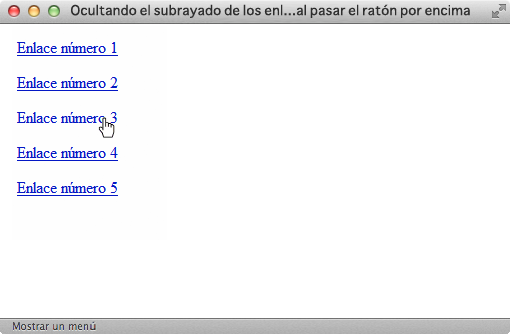
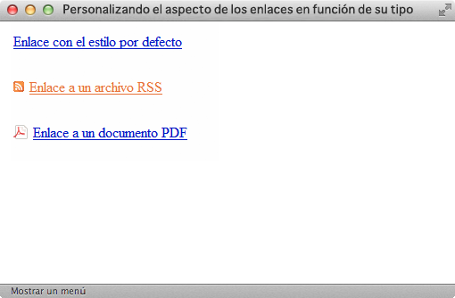
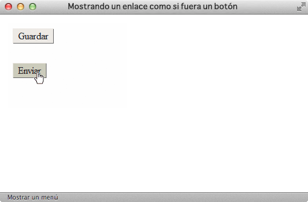

# Enlaces

## Estilos básicos

### Tamaño, color y decoración

Los estilos más sencillos que se pueden aplicar a los enlaces son los que modifican su tamaño de letra, su color y la decoración del texto del enlace. Utilizando las propiedades `text-decoration` y `font-weight` se pueden conseguir estilos como los que se muestran en la siguiente imagen:

A continuación se muestran las reglas CSS del ejemplo anterior:

    [css]
    a { margin: 1em 0; display: block;}
    
    .alternativo {color: #CC0000;}
    .simple {text-decoration: none;}
    .importante {font-weight: bold; font-size: 1.3em;}
    .raro {text-decoration:overline;}

    [html]
    <a href="#">Enlace con el estilo por defecto</a>
    <a class="alternativo" href="#">Enlace de color rojo</a>
    <a class="simple" href="#">Enlace sin subrayado</a>
    <a class="importante" href="#">Enlace muy importante</a>
    <a class="raro" href="#">Enlace con un estilo raro</a>

### Pseudo-clases

CSS también permite aplicar diferentes estilos a un mismo enlace en función de su estado. De esta forma, es posible cambiar el aspecto de un enlace cuando por ejemplo el usuario pasa el ratón por encima o cuando el usuario pincha sobre ese enlace.

Como con los atributos `id` o `class` no es posible aplicar diferentes estilos a un mismo elemento en función de su estado, CSS introduce un nuevo concepto llamado pseudo-clases. En concreto, CSS define las siguientes cuatro pseudo-clases:

* `:link`, aplica estilos a los enlaces que apuntan a páginas o recursos que aún no han sido visitados por el usuario.

* `:visited`, aplica estilos a los enlaces que apuntan a recursos que han sido visitados anteriormente por el usuario. El historial de enlaces visitados se borra automáticamente cada cierto tiempo y el usuario también puede borrarlo manualmente.

* `:hover`, aplica estilos al enlace sobre el que el usuario ha posicionado el puntero del ratón.

* `:active`, aplica estilos al enlace que está pinchando el usuario. Los estilos sólo se aplican desde que el usuario pincha el botón del ratón hasta que lo suelta, por lo que suelen ser unas pocas décimas de segundo.
Como se sabe, por defecto los navegadores muestran los enlaces no visitados de color azul y subrayados y los enlaces visitados de color morado. Las pseudo-clases anteriores permiten modificar completamente ese aspecto por defecto y por eso casi todas las páginas las utilizan.

El siguiente ejemplo muestra cómo ocultar el subrayado cuando el usuario pasa el ratón por encima de cualquier enlace de la página:

    [css]
    a:hover { text-decoration: none; }

Aplicando las reglas anteriores, los navegadores ocultan el subrayado del enlace sobre el que se posiciona el ratón:

Las pseudo-clases siempre incluyen dos puntos (`:`) por delante de su nombre y siempre se añaden a continuación del elemento al que se aplican, sin dejar ningún espacio en blanco por delante:

    [css]
    /* Incorrecto: el nombre de la pseudo-clase no se puede separar de los dos puntos iniciales */
    a: visited { ... }
    
    /* Incorrecto: la pseudo-clase siempre se añade a continuación del elemento al 		que modifica */
    a :visited { ... }
    
    /* Correcto: la pseudo-clase modifica el comportamiento del elemento <a> */
    a:visited { ... }

Las pseudo-clases también se pueden combinar con cualquier otro selector complejo:

    [css]
    a.importante:visited { ... }
    a#principal:hover { ... }
    div#menu ul li a.primero:active { ... }

Cuando se aplican varias pseudo-clases diferentes sobre un mismo enlace, se producen colisiones entre los estilos de algunas pseudo-clases. Si se pasa por ejemplo el ratón por encima de un enlace visitado, se aplican los estilos de las pseudo-clases `:hover` y `:visited`. Si el usuario pincha sobre un enlace no visitado, se aplican las pseudo-clases `:hover`, `:link` y `:active` y así sucesivamente.

Si se definen varias pseudo-clases sobre un mismo enlace, el único orden que asegura que todos los estilos de las pseudo-clases se aplican de forma coherente es el siguiente: `:link`, `:visited`, `:hover` y `:active`. De hecho, en muchas hojas de estilos es habitual establecer los estilos de los enlaces de la siguiente forma:

    [css]
    a:link, a:visited {
      ...
    }
    
    a:hover, a:active {
      ...
    }

Las pseudo-clases `:link` y `:visited` solamente están definidas para los enlaces, pero las pseudo-clases `:hover` y `:active` se definen para todos los elementos HTML. Desafortunadamente, Internet Explorer 6 y sus versiones anteriores solamente las soportan para los enlaces.

También es posible combinar en un mismo elemento las pseudo-clases que son compatibles entre sí:

    [css]
    /* Los estilos se aplican cuando el usuario pasa el ratón por encima de un
        enlace que todavía no ha visitado */
    a:link:hover { ... }
    
    /* Los estilos se aplican cuando el usuario pasa el ratón por encima de un 
        enlace que ha visitado previamente */
    a:visited:hover { ... }

  
Ejercicio 8

[Ver enunciado](#ej08)

## Estilos avanzados

### Decoración personalizada

La propiedad `text-decoration` permite añadir o eliminar el subrayado de los enlaces. Sin embargo, el aspecto del subrayado lo controla automáticamente el navegador, por lo que su color siempre es el mismo que el del texto del enlace y su anchura es proporcional al tamaño de letra.

No obstante, utilizando la propiedad `border-bottom es posible añadir cualquier tipo de subrayado para los enlaces de las páginas. El siguiente ejemplo muestra algunos enlaces con el subrayado personalizado:

Las reglas CSS definidas en el ejemplo anterior se muestran a continuación:

    [css]
    a { margin: 1em 0; float: left; clear: left; text-decoration: none;}
    .simple {text-decoration: underline;}
    .color { border-bottom: medium solid #CC0000;}
    .ancho {border-bottom: thick solid;}
    .separado {border-bottom: 1px solid; padding-bottom: .6em;}
    .discontinuo {border-bottom: thin dashed;}

    [html]
    <a class="simple" href="#">Enlace con el estilo por defecto</a>
    <a class="color" href="#">Enlace un subrayado de otro color</a>
    <a class="ancho" href="#">Enlace con un subrayado muy ancho</a>
    <a class="separado" href="#">Enlace con un subrayado muy separado</a>
    <a class="discontinuo" href="#">Enlace con un subrayado discontinuo</a>

### Imágenes según el tipo de enlace

En ocasiones, puede resultar útil incluir un pequeño icono al lado de un enlace para indicar el tipo de contenido que enlaza, como por ejemplo un archivo comprimido o un documento con formato PDF.

Este tipo de imágenes son puramente decorativas en vez de imágenes de contenido, por lo que se deberían añadir con CSS y no con elementos de tipo ``. Utilizando la propiedad `background` (y `background-image`) se puede personalizar el aspecto de los enlaces para que incluyan un pequeño icono a su lado.

La técnica consiste en mostrar una imagen de fondo sin repetición en el enlace y añadir el `padding necesario al texto del enlace para que no se solape con la imagen de fondo.

El siguiente ejemplo personaliza el aspecto de dos enlaces añadiéndoles una imagen de fondo:

Las reglas CSS necesarias se muestran a continuación:

    [css]
    a { margin: 1em 0; float: left; clear: left; }
    
    .rss {
      color: #E37529;
      padding: 0 0 0 18px;
      background: #FFF url(imagenes/rss.gif) no-repeat left center;
    }
    
    .pdf {
      padding: 0 0 0 22px;
      background: #FFF url(imagenes/pdf.png) no-repeat left center;
    }

    [html]
    <a href="#">Enlace con el estilo por defecto</a>
    
    <a class="rss" href="#">Enlace a un archivo RSS</a>
    
    <a class="pdf" href="#">Enlace a un documento PDF</a>

### Mostrar los enlaces como si fueran botones

Las propiedades definidas por CSS permiten mostrar los enlaces con el aspecto de un botón, lo que puede ser útil en formularios en los que no se utilizan elementos específicos para crear botones.

El siguiente ejemplo muestra un enlace simple formateado como un botón:

Las reglas CSS utilizadas en el ejemplo anterior son las siguientes:

    [css]
    a { margin: 1em 0; float: left; clear: left; }
    a.boton {
      text-decoration: none;
      background: #EEE;
      color: #222;
      border: 1px outset #CCC;
      padding: .1em .5em;
    }
    a.boton:hover {
      background: #CCB;
    }
    a.boton:active {
      border: 1px inset #000;
    }

    [html]
    <a class="boton" href="#">Guardar</a>
    <a class="boton" href="#">Enviar</a>