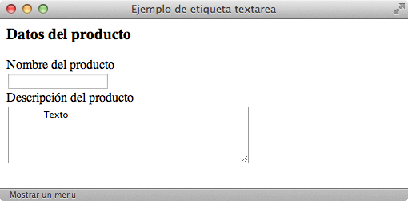
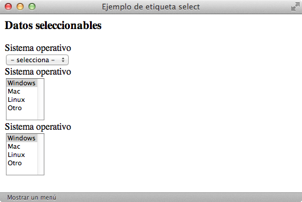
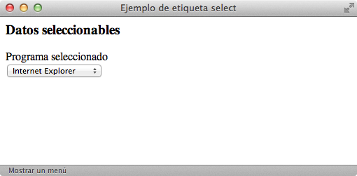

# Otros elementos de formulario

La etiqueta `<input>` permite crear diez tipos diferentes de controles de formulario. Sin embargo, algunas aplicaciones web utilizan otros elementos de formulario que no se pueden crear con `<input>`. Las listas desplegables y las áreas de texto disponen de sus propias etiquetas (`<select>` y `<textarea>` respectivamente).

Las áreas de texto son útiles cuando se debe introducir una gran cantidad de texto, ya que es mucho más cómodo de introducir que en un campo de texto normal:



```html
<form action="insertar_producto.php" method="post">
    <label for="nombre">Nombre del producto</label> <br/>
    <input type="text" id="nombre" name="nombre" value="" />
    <label for="descripcion">Descripción del producto</label> <br/>
    <textarea id="descripcion" name="descripcion" cols="40" rows="5">
        Texto
    </textarea>
</form>```

La definición formal de la etiqueta `<textarea>` es:

| Etiqueta              | `<textarea>`    |
| --------------------: | :------------- |
| **Atributos comunes** | básicos, internacionalización, eventos, foco |
| **Atributos propios** | `rows="numero"` Número de filas de texto que mostrará el textarea<br />`cols="numero"` Número de caracteres que se muestran en cada fila del textarea<br />Otros: `name`, `disabled`, `readonly`, `onselect`, `onchange`, `onfocus`, `onblur` |
| **Tipo de elemento**  | En línea |
| **Descripción**       | Se emplea para incluir un área de texto en un formulario |

Los atributos más utilizados en las etiquetas `<textarea>` son los que controlan su anchura y altura. La anchura del área de texto se controla mediante el atributo cols, que indica las columnas o número de caracteres que se podrán escribir como máximo en cada fila. La altura del área de texto se controla mediante rows, que indica directamente las filas de texto que serán visibles.

El principal inconveniente de los elementos `<textarea>` es que el lenguaje HTML no permite limitar el número máximo de caracteres que se pueden introducir. Mientras los elementos `<input type="text">` disponen del atributo `maxlength`, las áreas de texto no disponen de un atributo equivalente, por lo que sólo es posible limitar el número de caracteres mediante su programación con JavaScript.

Por otra parte, el otro control disponible para los formularios es el de las listas desplegables:



La imagen anterior muestra los tres tipos de listas desplegables disponibles. El primero es el de las listas más utilizadas que sólo muestran un valor cada vez y sólo permiten seleccionar un valor. El segundo tipo de lista es el que sólo permite seleccionar un valor pero muestra varios a la vez. Por último, el tercer tipo de lista desplegable es aquella que muestra varios valores y permite realizar selecciones múltiples.

El **código HTML** del ejemplo anterior sería:

```html
<label for="so">Sistema operativo</label> <br/>
<select id="so" name="so">
  <option value="" selected="selected">- selecciona -</option>
  <option value="windows">Windows</option>
  <option value="mac">Mac</option>
  <option value="linux">Linux</option>
  <option value="otro">Otro</option>
</select>
<label for="so2">Sistema operativo</label> <br/>
<select id="so2" name="so2" size="5">
  <option value="windows" selected="selected">Windows</option>
  <option value="mac">Mac</option>
  <option value="linux">Linux</option>
  <option value="otro">Otro</option>
</select>
<label for="so3">Sistema operativo</label> <br/>
<select id="so3" name="so3" size="5" multiple="multiple">
  <option value="windows" selected="selected">Windows</option>
  <option value="mac">Mac</option>
  <option value="linux">Linux</option>
  <option value="otro">Otro</option>
</select>```

Los tres tipos de listas desplegables se definen con la misma etiqueta `<select>` y cada elemento de la lista se define mediante la etiqueta `<option>`:

| Etiqueta              | `<select>`    |
| --------------------: | :------------- |
| **Atributos comunes** | básicos, internacionalización, eventos |
| **Atributos propios** | `size="numero"` Número de filas que se muestran de la lista (por defecto sólo se muestra una)<br />`multiple="multiple"` Si se incluye, se permite seleccionar más de un elemento<br >Otros: name, disabled, onchange, onfocus, onblur |
| **Tipo de elemento**  | En línea |
| **Descripción**       | Se emplea para incluir una lista desplegable en un formulario |

| Etiqueta              | `<option>`    |
| --------------------: | :------------- |
| **Atributos comunes** | básicos, internacionalización, eventos |
| **Atributos propios** | `selected="selected"` Indica si el elemento aparece seleccionado por defecto al cargarse la página<br />`value="texto"` El valor que se envía al servidor cuando el usuario elige esa opción<br />Otros: `label`, `disabled` |
| **Tipo de elemento**  | - |
| **Descripción**       | Se emplea para definir cada elemento de una lista desplegable |

La inmensa mayoría de listas desplegables que utilizan las aplicaciones web son simples, por lo que el código HTML habitual de las listas desplegables es:

```html
<label for="so">Sistema operativo</label> <br/>
<select id="so" name="so">
  <option value="" selected="selected">- selecciona -</option>
  <option value="windows">Windows</option>
  <option value="mac">Mac</option>
  <option value="linux">Linux</option>
  <option value="otro">Otro</option>
</select>```

La etiqueta `<select>` define la lista y encierra todas las opciones que muestra la lista. Cada una de las opciones de la lista se define mediante una etiqueta `<option>`. El atributo `value` de cada opción es obligatorio, ya que es el dato que se envía al servidor cuando el usuario envía el formulario. Para seleccionar por defecto una opción al mostrar la lista, se añade el atributo `selected` a la opción deseada.

Por otra parte, las listas desplegables permiten agrupar sus opciones de forma que el usuario pueda encontrar fácilmente las opciones cuando la lista es muy larga:



El **código HTML** correspondiente a la imagen anterior sería:

```html
<form id="formulario" method="post" action="">
<label for="programa">Programa seleccionado</label> <br/>
<select id="programa" name="programa">
  <optgroup label="Sistemas Operativos">
    <option value="Windows" selected="selected">Windows</option>
    <option value="Mac">Mac</option>
    <option value="Linux">Linux</option>
    <option value="Other">Otro</option>
  </optgroup>
  <optgroup label="Navegadores">
    <option value="Internet Explorer" selected="selected">Internet Explorer</option>
    <option value="Firefox">Firefox</option>
    <option value="Safari">Safari</option>
    <option value="Opera">Opera</option>
    <option value="Other">Otro</option>
  </optgroup>
</select>
</form>```

La etiqueta `<optgroup>` permite agrupar opciones relacionadas dentro de una lista desplegable. Su definición formal se muestra a continuación:

| Etiqueta              | `<optgroup>`    |
| --------------------: | :------------- |
| **Atributos comunes** | básicos, internacionalización, eventos |
| **Atributos propios** | `label="texto"` Texto que se muestra como título de la agrupación de opciones<br />Otros: `disabled`, `selected` |
| **Tipo de elemento**  | - |
| **Descripción**       | Se emplea para definir una agrupación lógica de opciones de una lista desplegable |

El único atributo que suele utilizarse con la etiqueta `<optgroup>` es `label`, que indica el nombre de cada agrupación. Los navegadores muestran de forma destacada el título de cada agrupación, de forma que el usuario pueda localizar más fácilmente la opción deseada.

> **Ejercicio**

> Realizar el ejercicio #15 del [capítulo de ejercicios](../ejercicios/).

> **Ejercicio**

> Realizar el ejercicio #16 del [capítulo de ejercicios](../ejercicios/).
