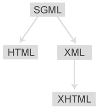

# ¿Qué es HTML?

**HTML** *(HyperText Markup Language)* es un lenguaje de marcas usado, de manera predominante, para la elaboración de páginas web. El lenguaje **HTML** es utilizado en forma de texto para describir y crear la estructura de estas páginas, tanto por programas, que traducen un diseño de página en código HTML, como por parte de las personas de manera directa.

Este lenguaje es un estándar reconocido mundialmente y cuyas normas vienen dadas por el *World Wide Web Consortium* o [**W3C**](http://www.w3.org/) - consorcio internacional que produce recomendaciones para la *World Wide Web* -, lo que hace que una misma página HTML sea visualizada de forma *similar* en diferentes navegadores y sistemas operativos.

## Especificación oficial

Este organismo **W3C** elabora las normas a seguir para la creación de las páginas HTML o XHTML. Sin embargo, no es necesario conocer todas estas especificaciones, escritas en un lenguaje bastante formal, para diseñar páginas con este lenguaje.  Las normas oficiales están escritas en inglés y se pueden consultar de forma gratuita en las siguientes direcciones:

- [Especificación oficial de HTML 4.01](http://www.w3.org/TR/html401/)
- [Especificación oficial de XHTML 1.0](http://www.w3.org/TR/xhtml1/)

El estándar XHTML 1.0 incluye el 95% del estándar HTML 4.01, ya que sólo añade pequeñas mejoras y modificaciones menores. Este sería un sencillo gráfico del esquema de relación y evolución de los lenguajes **HTML** y **XHTML** *(eXtensible HyperText Markup Language)* - que es básicamente HTML expresado como **XML** válido, una versión más estricta a nivel técnico - :

## HTML, CSS y Javascript

Originalmente, las páginas HTML sólo incluian información sobre sus contenidos de texto e imágenes. Con el desarrollo del **estándar HTML**, las páginas empezaron a incluir también información sobre el aspecto de sus contenidos.

La posterior aparición de tecnologías como **JavaScript** provocó que las páginas HTML también incluyeran el código de las aplicaciones (llamadas *scripts*) que se utilizan para crear páginas web dinámicas.

Una página web está compuesta, como vemos en este gráfico, por **contenidos, presentación e interacción**. Esto es, está subdividida de manera que, en vez de incluir en una misma página todo, se utilizan mecanismos para separar dichos contenidos: como son **CSS** y **JavaScript**.

