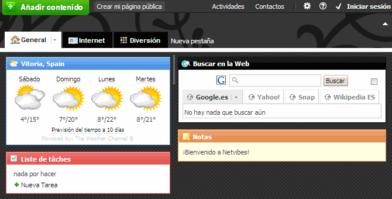
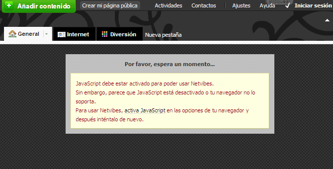

# JavaScript

Como ya se explicó en los capítulos anteriores, la __etiqueta `<script>`__ se utiliza para enlazar **archivos JavaScript externos** y para incluir **bloques de código JavaScript en las páginas**. Sin embargo, algunos navegadores no disponen de soporte completo de JavaScript, otros navegadores permiten bloquearlo parcialmente e incluso algunos usuarios bloquean completamente el uso de JavaScript porque creen que así navegan de forma más segura.

Si JavaScript está bloqueado o deshabilitado y la página web requiere su uso para un correcto funcionamiento, es habitual incluir un mensaje de aviso al usuario indicándole que debería activar JavaScript para disfrutar completamente de la página.

El siguiente ejemplo muestra una misma página web que requiere JavaScript tanto cuando se accede con JavaScript activado y como cuando se accede con JavaScript completamente desactivado.





HTML define la etiqueta `<noscript>` para incluir un mensaje que los navegadores muestran cuando JavaScript se encuentra bloqueado o deshabilitado.

| Etiqueta              | `<noscript>`    |
| --------------------: | :------------- |
| **Atributos comunes** | básicos, internacionalización, eventos |
| **Atributos propios** | - |
| **Tipo de elemento**  | En bloque |
| **Descripción**       | Define un mensaje alternativo que se muestra al usuario cuando su navegador no soporta la ejecución de scripts. De esta forma, incluir un mensaje de aviso que solamente sea visible en los navegadores que tienen bloqueado JavaScript es tan sencillo como incluir la etiqueta `<noscript>` dentro del `<body>` |

```html
<head> ... </head>
<body>
    <noscript>
      <p>Bienvenido a Mi Sitio</p>
      <p>La página que estás viendo requiere para su funcionamiento
      el uso de JavaScript. Si lo has deshabilitado intencionadamente,
      por favor vuelve a activarlo.</p>
    </noscript>
</body>```

