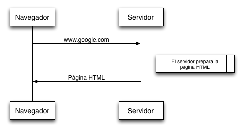

# ¿QUÉ ES HTTP?

**Hypertext Transfer Protocol** o **HTTP** (en castellano *protocolo de transferencia de hipertexto*) es el protocolo usado en cada transacción de la World Wide Web. HTTP fue desarrollado por el World Wide Web Consortium ([W3C](http://www.w3.org/)) y la Internet Engineering Task Force, colaboración que culminó en 1999 con la publicación de una serie de RFC, el más importante de ellos es el RFC 2616 que especifica la versión 1.1. HTTP define la sintaxis y la semántica que utilizan los elementos de software de la arquitectura web (clientes, servidores, proxies) para comunicarse.

Es un protocolo orientado a transacciones y **sigue el esquema petición-respuesta entre un cliente y un servidor**. Al cliente que efectúa la petición (un navegador web o un spider) se lo conoce como "user agent" (agente del usuario). A la información transmitida se la llama recurso y se la identifica mediante un **localizador uniforme de recursos (URL)**. El resultado de la ejecución de un programa, una consulta a una base de datos, la traducción automática de un documento, etc.

## HTTP es simple

HTTP es un **protocolo sin estado**, es decir, que no guarda ninguna información sobre conexiones anteriores. El desarrollo de aplicaciones web necesita frecuentemente mantener estado. Para esto se usan las cookies, que es información que un servidor puede almacenar en el sistema cliente. Esto le permite a las aplicaciones web instituir la noción de "sesión", y también permite rastrear usuarios ya que las cookies pueden guardarse en el cliente por tiempo indeterminado.

HTTP es el término utilizado para describir este sencillo lenguaje basado en texto. No importa cómo se desarrolle, el objetivo del servidor será siempre entender y devolver respuestas de texto sencillo.

Es también uno de los protocolos que cierra la brecha entre los grupos de creación de redes y desarrollo de aplicaciones, ya que contiene información que es utilizada por los dos en la entrega y el desarrollo de aplicaciones basadas en web.

