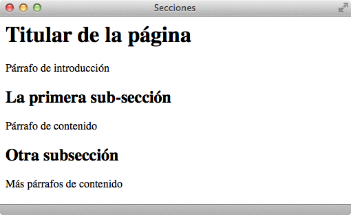

# Cómo estructurar un texto

## Párrafos

| Etiqueta              | `<p>`    |
| --------------------: | :------------- |
| **Atributos comunes** | básicos, internacionalización, eventos |
| **Atributos propios** | - |
| **Tipo de elemento**  | En bloque |
| **Descripción**       | Delimita el contenido de un párrafo de texto |

Esta etiqueta `<p>` permite definir los **párrafos** que forman el texto de una página. Como se puede ver en la tabla anterior, estos párrafos son **elementos en bloque**, por lo que ocupan toda la anchura del navegador. No presentan **atributos** específicos pero sí se les pueden asignar los atributos comunes de HTML básicos, de internacionalización y de eventos.

Un ejemplo de **código HTML** con la etiqueta `<p>` sería:

```html
<html>
    <head>
        <title>Párrafos</title>
    </head>
    <body>
        <p>Este es el texto que forma el primer párrafo de la página.
        Los párrafos pueden ocupar varias líneas y el navegador se encarga
        de ajustar su longitud al tamaño de la ventana.</p>
        <p>El segundo párrafo de la página también se define encerrando
        su texto con la etiqueta p. El navegador también se encarga de
        separar automáticamente cada párrafo.</p>
    </body>
</html>```


Y un navegador lo visualizaría de esta manera:


### Secciones

| Etiqueta              | `<h1>`,`<h2>`,`<h3>`,`<h4>`,`<h5>`,`<h6>`    |
| --------------------: | :------------- |
| **Atributos comunes** | básicos, internacionalización, eventos |
| **Atributos propios** | - |
| **Tipo de elemento**  | En bloque |
| **Descripción**       | Define los títulos de las secciones de mayor importancia de la página |

Estas etiquetas `<h1>`…`<h6>` definen **títulos de sección**, no secciones completas. Como se puede ver en la tabla anterior y al igual que el *tag* `<p>`, estas secciones son **elementos en bloque**, por lo que ocupan toda la anchura del navegador y tampoco presentan **atributos** específicos pero sí se les pueden asignar los atributos comunes de HTML básicos, de internacionalización y de eventos.

Los navegadores asignan de forma automática el tamaño del título de cada sección en función de su importancia, que se puede modificar utilizando las hojas de estilos **CSS**.

Un ejemplo de **código HTML** con la etiqueta `<p>` más las etiquetas `<h1>`y `<h2>` sería:

```html
<html>
    <head>
        <title>Secciones</title>
    </head>
    <body>
        <h1>Titular de la página</h1>
        <p>Párrafo de introducción</p>
        <h2>La primera sub-sección</h2>
        <p>Párrafo de contenido</p>
        <h2>Otra subsección</h2>
        <p>Más párrafos de contenido</p>
    </body>
</html>```


Y un navegador lo visualizaría de esta manera:


