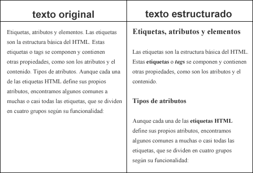
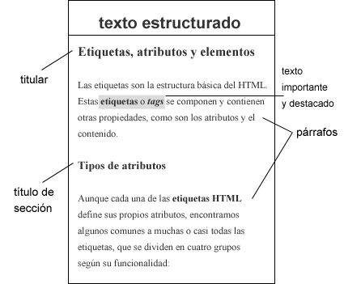

# Texto

La mayor parte de las **páginas HTML** están formadas por **texto** (llegando a ser más del 90% del código de la página).
Este lenguaje define *tags* para **estructurar** el contenido y otros para **marcar** elementos importantes dentro del texto.

El proceso de **estructuración** de un texto simple consiste en indicar las diferentes zonas o secciones que componen un texto: como son los párrafos o títulos de sección.

El proceso posterior a estructurar el texto consiste en **marcar** los diferentes elementos dentro de éste: definiciones, abreviaturas, textos importantes, textos modificados, citas a otras referencias, etc.

Un **ejemplo** de texto original y otro de texto estructurado sería:

Este ejemplo muestra una transformación de un párrafo con un **texto simple** a un **texto estructurado y marcado** donde encontramos:

